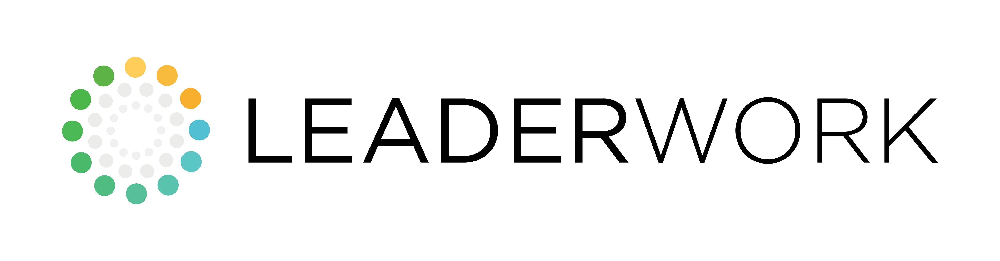

<picture>
  <source media="(prefers-color-scheme: dark)" srcset="./assets/lw-logo-horizontal-dark.png">
  <source media="(prefers-color-scheme: light)" srcset="./assets/lw-logo-horizontal-light.png">
  
</picture>

### GREAT LEADERS CREATE THRIVING ORGANIZATIONS

**Leader development and leadership-process consulting for organizations that want to grow their people as deliberately as they grow their business.**

&nbsp;

---

## WHO WE ARE

LeaderWork helps organizations build thriving businesses that meet the expectations of all
their stakeholders — owners, employees, customers, suppliers, and the communities they
operate in — through skilled leaders and capable leadership processes.

Our approach is grounded in decades of real-world operating experience, not theory. We
develop leaders in both **character** — vision, integrity, and the bravery to act — and
**capability** — the practical skills a leader uses with their team every day. Leadership,
in our view, is *the* defining differentiator: good leadership makes good organizations,
and great leadership makes great ones.

## WHAT WE DO

| | |
|---|---|
| **[LeaderWork 12 — *What Leaders DO*](https://leader-work.com/services/leaderwork-12/)** | A 12-session core-competency course that gives an organization a common leadership language and a shared standard of practice. |
| **[Leader](https://leader-work.com/services/leader-development/) & [Executive Development](https://leader-work.com/services/executive-leader-development/)** | Cohort learning paired with one-on-one executive coaching, from first-time and front-line leaders to the C-suite. |
| **[Corporate Culture](https://leader-work.com/services/corporate-culture/) & [Strategic Planning](https://leader-work.com/services/strategic-planning/)** | Facilitation that turns direction into repeatable, visible operating rhythms. |
| **[Team Building](https://leader-work.com/services/team-building/) & [Speaking](https://leader-work.com/services/public-speaking/)** | Hands-on sessions and keynotes drawn from real operating experience. |
| **[Online Leader Training](https://leaderwork.thinkific.com/)** | Self-paced leader development, available anywhere. |

## HOW WE WORK

Leadership can be introduced in the classroom but it is perfected in the field. That is
why coaching sits at the center of everything we do — both a leader's own boss and their
assigned LeaderWork coach give feedback on the effectiveness of what they actually *do*.
We combine classroom learning, peer support within a cohort, and personalized executive
coaching so that progress shows up in daily action and in measurable results.

There are no quick fixes. Leader development is a lifelong process, and our job is to make
the work practical, repeatable, and immediately useful with your team.

## WHAT'S IN THIS ORG

This GitHub organization hosts the tooling LeaderWork uses to deliver and scale its work —
including Claude Code plugins for generating branded **LW12 Executive Leadership Diagnostic
Reports** and for applying LeaderWork brand standards across deliverables.

## CONNECT

**[leader-work.com](https://leader-work.com/)** &nbsp;·&nbsp;
**[Services](https://leader-work.com/services/)** &nbsp;·&nbsp;
**[Clients](https://leader-work.com/clients/)** &nbsp;·&nbsp;
**[Blog & Resources](https://leader-work.com/blog-resources/)** &nbsp;·&nbsp;
**[Contact](https://leader-work.com/contact/)**

© 2026 LeaderWork · leader-work.com

